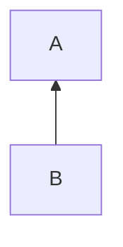
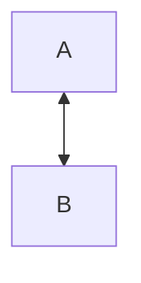
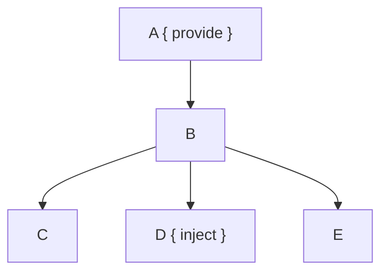
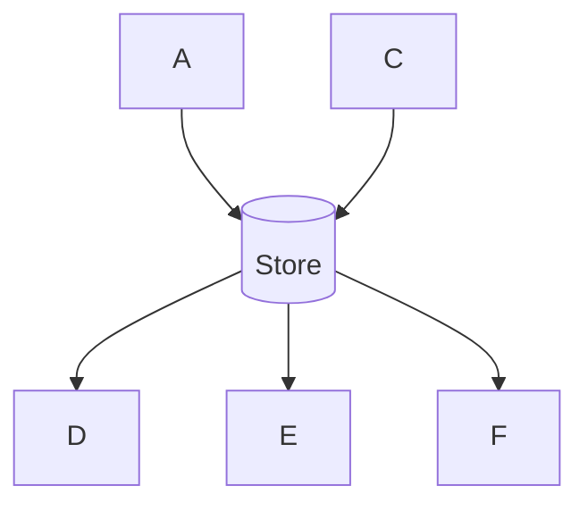
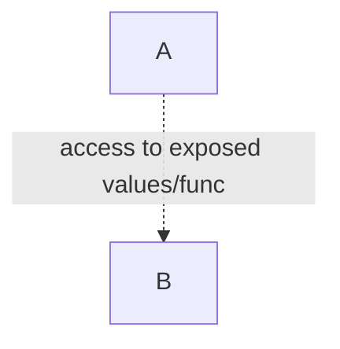

# Data passing between vue components

Passing data from one component to another component via `props` and `events` is a core concept of vue. But `props` and `events` are not the only ways for doing that. Let's take a deeper look at [`props`](#props), [`events`](#events), [`v-model`](#v-model), [`provide/inject`](#provideinject), [`stores`](#using-store-data) and [`defineExpose`](#defineexpose) to see how to handle the data exchange and what to use when.

## props
Props are the basic way to pass data from a parent component to a child component. The child component defines which props it will accept

``` vue
<script setup>
defineProps({
    says: {
        type: String
    }
})
</script>
```

The parent component passes the data by setting the props:

``` vue
<Animal says="meow" />
```

This is just a one way communication. The data changes in the parent will flow down to the child component. Therefore avoid prop mutating as every data change in the parent overwrites the value. 

Nice hint: It's possible to add a validator to the prop definitions to show a warning in the console, when the parent component hands over data that can't be processed by the child component. 

``` vue
<script setup>
defineProps({
    species: {
        type: String,
        validator(value, props) {
          return ['cat', 'dog', 'fox'].includes(value)
        }
    }
})
</script>
```


### Summed up
**One** way data passing **from** parent component **to** direct child component.


Read more:
https://vuejs.org/guide/components/props.html#props


## events
Events inform the parent component about changes in the child component.

The child component declares the emits

``` vue
<script setup>
const emits = defineEmits(['made-some-noise'])
</script>
```

and emits the event in the template or in a function
``` vue
<template>
  <Button @click="beLoud">Make a loud {{ props.says }} </Button>
  <Button @click="$emit('made-some-noise', 'low')">Make a low {{ props.says }} </Button>
</template>

<script setup>
...
const beLoud = () => {
    emits('made-some-noise', 'loud')
}
</script>
```

The parent component listens to the emits and can read the arguments
``` vue
<template>
  <Animal says="woof" @made-some-noise="onNoise($event)" />
</template>

<script setup>
...
const onNoise = (volume) => {
   console.log('The animal was: ', volume)
}
</script>
```


### Summed up
**One** way data passing **from** child component **to** parent component.



## v-model 
If you need to modify the value within the parent component **and** the child component vue offers the `v-model`. 

In the child component you declare the model:
``` vue
<script setup>
const amountOfFood = defineModel('amountOfFood', {
	type: Number,
	required: true
})

const eat = () => {
    amountOfFood.value = amountOfFood.value - 1
}
</script>

<template>
    <div v-if="amountOfFood === 0">Feed me!</div>
    <Button v-else @click="eat">Yummy!</Button>
</template>
```

The parent component binds a value to this model
``` vue
<script setup>
const food = ref(0)

const feed = () => {
    food.value += Math.floor(Math.random() * 5)
}
</script>

<template>
  <Animal v-model:amount-of-food="food" />
  The animal has still {{ food }} food left.
  <Button @click="feed">Feed it!</Button>
</template>
```

Whenever the value changes both components will be informed about the new value.

Having a look at the [vue documentation about `v-model`](https://vuejs.org/guide/components/v-model.html#under-the-hood), you see that "under the hood" v-model is just props and events. You could even build your own v-model. 


### Summed up
**Two** way data passing **between** parent component **and** direct child component.



Read more:
https://vuejs.org/guide/components/v-model.html

## provide/inject
Sometimes you need data from a parent component inside of a deeper child component, but the child components in between don't care about this data. You could do prop drilling and hand over the data into each component or you could use provide/inject. 

The parent component provides data as a key-value-pair
``` vue
<script setup>
const habitat = ref('ZOO')
provide(/* key */ 'habitat', /* value */ habitat)
</script>
```

Child components uses inject to access the data via the key information
``` vue
<script setup>
const myHabitat = inject('habitat')
</script>
```

or with default value:
``` vue
<script setup>
const myHabitat = inject('habitat', 'Wald')
</script>
```

In terms of deciding when to use prop drilling and when to use provide/inject - I would apply a modified Rule Of Three: when passing data through a third component, better use provide/inject.

### Summed up
**One** way data passing **from** parent component **to** a deeper child component.



Read more:
https://vuejs.org/guide/components/provide-inject.html


## using store data
Data that is needed in different components can be transferred to a store (e.g. pinia). 

Define the store
``` js
export const useWildlifeParkStore = defineStore('wildlifePark', () => {
  const animals = ref([])

  return { animals }
})
```

The stored data can be read and modified from every component
``` vue
<script setup>
const wildlifeParkStore = useWildlifeParkStore()
const { animals } = storeToRefs(wildlifeParkStore)
</script>

<template>
Currently we have these stuffed animals from our wildlife park:
  <template v-for="animal in animals">
    {{ animal }}
  </template>
</template>
```

Also for thinking about using a store to manipulate data, you could apply a modified Rule Of Three: when the data is needed in more than 2 different components, think about having a store for it.

### Summed up
**Multi** way data passing **over** the store **to** other components.



Read more:
https://pinia.vuejs.org/core-concepts/


## defineExpose
Last we have more of an edge case. What if you need data inside a parent component that is handled inside a child component and logically fits perfect into the child component? For this case vue provides `defineExpose` which basically opens the child component and makes defined functions or plain values public to the parent component.

The child component exposes values or functions:
``` vue
<script setup>
const jobList = ['walk', 'pet', 'feed']
const currentJob = computed(() => {
  if (jobList.length > 0) {
      return jobList[0]
  } else {
    return 'nothing'
  }
})

defineExpose({currentJob})
</script>
```

The parent component can use these via `template ref`
``` vue
<script setup>
const animalAttendentRef = useTemplateRef('my-animal')
onMounted(() => {
    console.log('Working on ', animalAttendentRef.value.currentJob)
})
</script>

<template>
  <AnimalAttendent ref="my-animal" />
</template>
```


### Summed up
Give access **to** the parent component for using methods or plain values **from** a child component.



Read more:
https://vuejs.org/api/sfc-script-setup.html#defineexpose